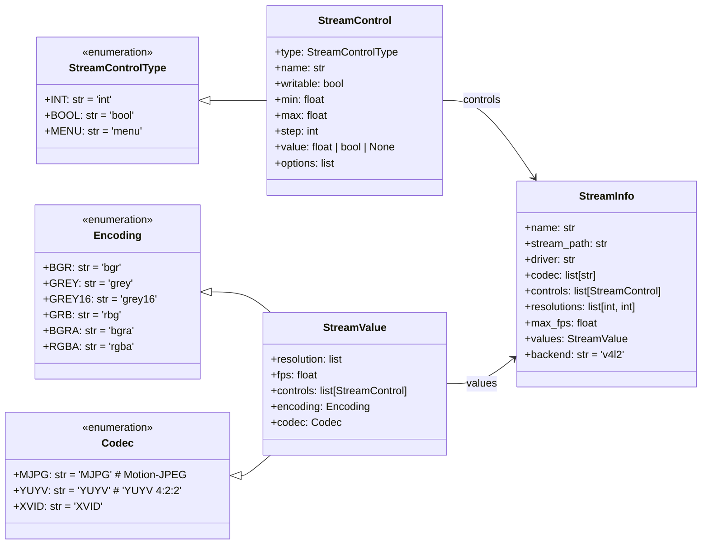

# Video Stream Data
Dependency-free data structures for video streaming.

## Installation
Use **pip** to install. Its recommended to install in a virtual environment

```bash
python3 -m venv video-streaming-pipeline
# install using system-site-packages (like opencv and pyudev)
source video-streaming-pipeline/bin/activate --system-site-packages
pip3 install video_stream_data
```

Although not recommended a user installation with `--break-system-packages` would also be okay as it does not have any dependencies.

## Usage
Simply import the data classes you want to have, you can use the parser to load the video stream settings from a file (see `test/`-folder).

You can use the data structure to manually create any kind of video stream.



*Fig. 1: Data Model for the StreamInfo generated from any device*
